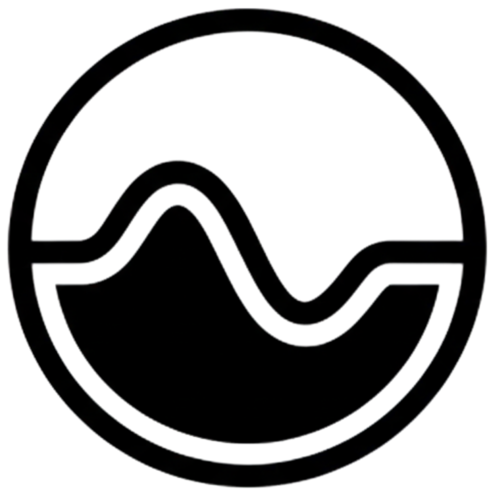

# GoStreamix

<p align="center">
  
</p>

GoStreamix is a lightweight and user-friendly stream control panel and engine designed to manage live broadcasts, video storage, and system settings in one place.

## Core Features

- Administrator access with secure login.
- Real-time system monitoring including CPU, memory, and network usage.
- Centralized stream management for active broadcasting channels.
- Media storage for managing recorded videos and assets.
- Mobile-friendly interface that works on all devices.
- Multi-language support (English and Indonesian).
- Professional dark theme for comfortable viewing.

## Development Guide

### 1. Clone the Project

```bash
git clone https://github.com/codewithwan/gostreamix.git
cd gostreamix
```

### 2. Run with Docker (Recommended)

This method includes automatic hot-reloading for rapid development. Every time you save a file, the application will rebuild and restart inside the container.

```bash
docker-compose -f docker-compose.dev.yml up --build
```

Access the application at: http://localhost:8080

### 3. Run Locally (Manual)

If you prefer to run the application directly on your machine without Docker:

1. **Install Prerequisites**: Go (1.25 or later) and Templ CLI.
2. **Generate UI Components**:
   ```bash
   templ generate
   ```
3. **Run the Server**:
   ```bash
   go run main.go
   ```

## Development Features

- **Hot Reload**: Powered by Air, the system detects changes in code, templates, and translations, performing automatic updates without manual intervention.
- **Data Persistence**: Development data and databases are stored in Docker volumes, ensuring your progress is not lost when containers are stopped.

---

Built by [codewithwanwan](https://github.com/codewithwan)
