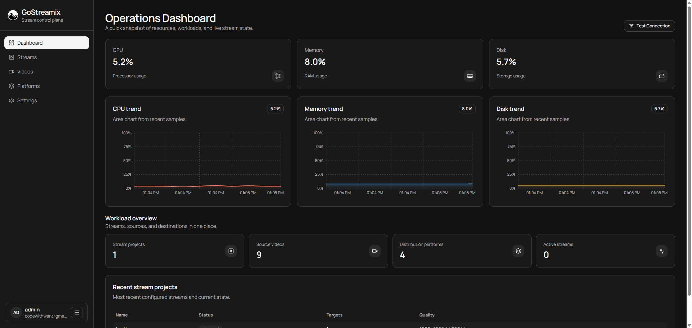
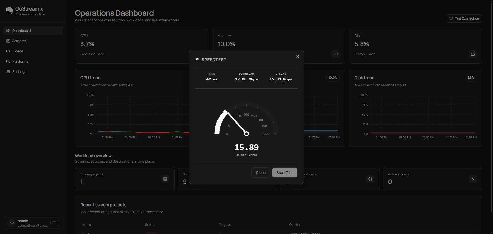
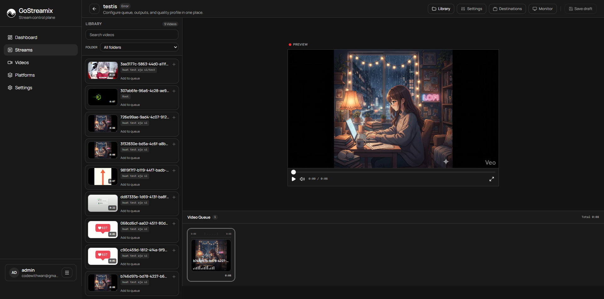
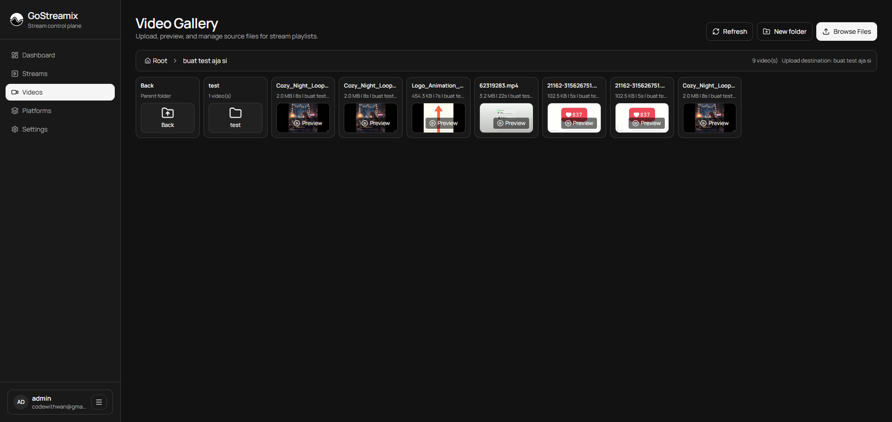
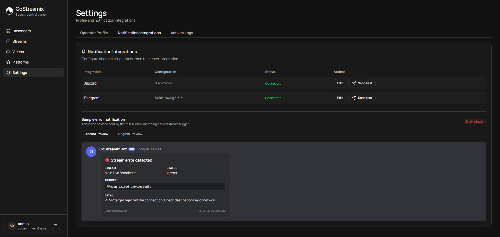

# GoStreamix

<p align="center">
  
</p>

<p align="center">
  <a href="https://github.com/codewithwan/gostreamix/actions/workflows/ci.yml"></a>
  <a href="https://github.com/codewithwan/gostreamix/actions/workflows/codeql.yml"></a>
  <a href="https://github.com/codewithwan/gostreamix/actions/workflows/dependency-review.yml"></a>
  <a href="LICENSE"></a>
  
  
</p>

GoStreamix is a self-hosted live streaming control panel for managing streams, platforms, video assets, notifications, and system monitoring from one web interface. The MVP is already usable: the Go backend, embedded React dashboard, SQLite datastore, FFmpeg-powered media workflow, Docker setup, and automated tests are all wired together.

## UI Preview

### Operations Dashboard


### Speed Test Diagnostic


### Stream Editor


### Video Gallery


### Notification Channels


## Features & Capabilities

Here is a detailed breakdown of what GoStreamix offers to help you manage your streaming workflow:

### 📊 Operations Dashboard
* **System Metrics:** Real-time monitoring of host CPU, Memory, and Disk utilization, complete with visual chart history.
* **Speedtest Utility:** Built-in connection speed diagnostics (Ping, Download, and Upload speeds) with a vintage dial gauge and fluid transition timing to test your stream server's network bandwidth.
* **Overview Statistics:** A quick snapshot of active streams, video assets, configured platforms, and recent stream logs.

### 🎬 Stream Program Editor
* **Media Library Integration:** Drag-and-drop or click to easily insert local video files from your galleries.
* **Interactive Timeline Strip:** Add, duplicate, re-order, and delete clips directly on the timeline.
* **Preview Player:** Built-in video player supporting live playback preview, mute control, and transition tests.
* **Output Stream Configuration:** Edit bitrate, resolution, FPS, and bind to target streaming platforms.

### 📁 Smart Video Library
* **Media Management:** Upload video assets, generate high-definition thumbnails automatically, preview clips, and delete files.
* **Folder Explorer:** Group your streaming assets using sub-directories and nested paths.
* **Batch Operations:** Multi-select files and folders to delete or move them in one click.

### 🚀 Platform Presets & RTMP Targets
* **Direct RTMP Streaming:** Configure presets for Facebook, YouTube, Twitch, TikTok, or custom server RTMP targets.
* **Secure Access:** Protect your streaming keys with automatic frontend masking.

### 🔔 System Notifications
* **Alert Notifications:** Get notified immediately on start, stop, or failed stream events.
* **Discord Webhook:** Instant logs sent to your Discord server channels.
* **Telegram Bot:** Automatic chat-id detection to wire logs directly to your Telegram chat or groups.

### 📋 Activity Logs & Auditing
* **Operational History:** Searchable logs displaying requests, events, status codes, HTTP methods, and IP logs for full transparency.

## Tech Stack

- Backend: Go 1.25, Fiber, Bun ORM, SQLite, Dig dependency injection, Zap logging.
- Frontend: React 19, Vite 8, TypeScript 6, Tailwind CSS 4, Radix UI, Recharts, Lucide icons.
- Media/runtime: FFmpeg, thumbnail generation, local file storage.
- Tests: Go tests plus Vitest, React Testing Library, and jsdom.
- Deployment: multi-stage Docker image and Docker Compose.

## CI Status

The repository ships with GitHub Actions for the MVP quality gate:

- `CI`: source guard, frontend dependency audit, frontend tests, frontend build, Go vet, full Go test suite, govulncheck, and Docker image builds.
- `CodeQL`: Go and JavaScript/TypeScript security analysis.
- `Dependency Review`: pull request dependency review with high-severity blocking.
- `Dependabot`: weekly updates for npm, Go modules, and GitHub Actions.

## Project Status

GoStreamix is in MVP stage. Core app flows are implemented and runnable, but the project should still be treated as active development. Expect APIs, UI details, and storage behavior to evolve as the product hardens.

Good for:

- Local streaming control experiments.
- Small self-hosted deployments.
- Developing stream/media workflow features.
- Testing dashboard, platform, video, and notification flows.

Not yet guaranteed for:

- Large multi-tenant production use.
- Hosted SaaS operation without additional hardening.
- Zero-downtime upgrades across changing schema/features.

## Quick Start With Docker

Docker is the recommended path for development because the dev image includes Go, Node.js, npm, FFmpeg, and Air hot reload.

```bash
docker compose -f docker-compose.dev.yml up --build
```

Open:

```text
http://localhost:8080
```

Useful Make targets:

```bash
make dev      # build and run the dev container
make up       # start the dev container in the background
make logs     # follow dev container logs
make shell    # open a shell inside the dev container
make down     # stop dev containers
make clean    # stop and remove dev volumes
make restart  # restart the dev container
```

## Manual Local Setup

Install prerequisites:

- Go 1.25 or newer.
- Node.js compatible with the frontend toolchain.
- npm.
- FFmpeg available on `PATH`.

Install frontend dependencies:

```bash
npm install --prefix ./web
```

Build the embedded frontend:

```bash
npm run build --prefix ./web
```

Run the Go server:

```bash
go run main.go
```

Open:

```text
http://localhost:8080
```

For frontend-only iteration:

```bash
npm run dev --prefix ./web
```

## Configuration

Copy `.env.example` when you need local overrides:

```bash
cp .env.example .env
```

Available settings:

| Variable | Default | Description |
| --- | --- | --- |
| `PORT` | `8080` | HTTP port used by the Go server. |
| `HOST` | `0.0.0.0` | Bind address for the server. |
| `APP_URL` | `http://localhost:8080` | Public app URL used by runtime messages and links. |
| `LOG_LEVEL` | `info` | Application log level. |
| `DB_PATH` | `data/db/gostreamix.sqlite` | SQLite database location. |
| `JWT_SECRET` | generated if empty | Secret used for JWT sessions. If empty, the app creates and reuses `app.key` beside the database. |
| `PROXY_HEADER` | empty | Optional proxy header configuration for deployments behind a proxy. |

Runtime data is stored under `data/` by default. Production Docker Compose mounts `./data:/app/data` so uploads, thumbnails, database files, and generated secrets survive container restarts.

## Production Docker

Build and run the production compose stack:

```bash
docker compose up --build -d
```

Follow logs:

```bash
docker compose logs -f
```

Stop:

```bash
docker compose down
```

The production image builds the React app, embeds the frontend assets into the Go binary package, installs FFmpeg, exposes port `8080`, and includes a `/health` healthcheck.

## Testing

Run all Go tests:

```bash
go test ./...
```

Run all frontend tests:

```bash
npm test --prefix ./web
```

Run frontend unit or e2e-style suites separately:

```bash
npm run test:unit --prefix ./web
npm run test:e2e --prefix ./web
```

Build the frontend:

```bash
npm run build --prefix ./web
```

Build the full app binary after frontend assets are available:

```bash
go build ./...
```

## Application Routes

Main web routes:

- `/setup`
- `/login`
- `/dashboard`
- `/streams`
- `/streams/:id/editor`
- `/videos`
- `/platforms`
- `/settings`
- `/activity`

Runtime routes:

- `/health` for health checks.
- `/ws` for websocket updates.
- `/assets`, `/main/assets`, and `/thumbnails` for static/runtime assets.
- `/api/auth`, `/api/dashboard`, `/api/streams`, `/api/videos`, `/api/platforms`, and `/api/settings/notifications` for domain APIs.

## Repository Layout

```text
.
├── cmd/                         # Optional command-line entrypoints
├── internal/
│   ├── core/                    # Dependency injection and bootstrap
│   ├── domain/                  # Auth, dashboard, notification, platform, stream, video domains
│   ├── infrastructure/          # Database, server, frontend embedding, monitor, websocket
│   └── shared/                  # Shared middleware, JWT, validation, utilities
├── web/
│   ├── src/                     # React application source
│   └── tests/                   # Vitest and Testing Library suites
├── assets/                      # Static assets copied into the runtime image
├── data/                        # Local runtime data, ignored by normal deployment workflows
├── Dockerfile                   # Production image
├── Dockerfile.dev               # Development image with hot reload
├── docker-compose.yml           # Production compose stack
└── docker-compose.dev.yml       # Development compose stack
```

## Development Notes

- The frontend alias `@/` points to `web/src`.
- Production frontend assets are generated into `internal/infrastructure/frontend/build`.
- The backend serves the embedded SPA for app pages and redirects `/` to `/dashboard`.
- System stats are broadcast over websockets every few seconds.
- FFmpeg is required for media probing, stream processing, and thumbnail-related workflows.
- Do not commit local database files, uploads, generated thumbnails, secrets, or runtime logs.

## Contributing

Contributions are welcome. Please read [CONTRIBUTING.md](CONTRIBUTING.md) before opening an issue or pull request.

## License

GoStreamix is released under the [MIT License](LICENSE).

---

Built by [codewithwanwan](https://github.com/codewithwan).
